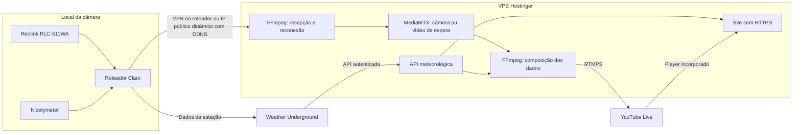

# Olhar Três Picos

Painel responsivo em português para a câmera Reolink RLC-511WA e a estação Nicetymeter INOVAF30. Projeto preparado para VPS Hostinger, sem computador ou mini PC no local da câmera.

## O que está implementado

- Interface para desktop e celular, player YouTube, oito indicadores, histórico diário dos últimos 30 dias e controles de compartilhamento/tela cheia.
- API Weather Underground no servidor: unidades métricas, cache, deduplicação de consultas, timeout e indicação explícita de leitura antiga. A chave nunca é enviada ao navegador.
- Prévia opt-in com dados ilustrativos em `/?demo=1`, disponível apenas no desenvolvimento ou com `ALLOW_DEMO=true`. A produção desabilita a prévia.
- Página transparente `/overlay` para uso opcional como Browser Source. A solução padrão no VPS usa FFmpeg, sem OBS ou interface gráfica.
- Configuração Docker Compose para HTTPS, site, recepção RTSP, vídeo de espera, sobreposição meteorológica e envio RTMPS ao YouTube.
- Reprodução direta opcional no site por URL pública HLS (`.m3u8`) ou MP4, sem expor a URL RTSP da câmera.
- Supervisão dos processos de vídeo: reinício com espera progressiva e watchdog de progresso.

**Estado atual:** interface, build e testes de dados verificados localmente. Não houve implantação no VPS, acesso à câmera, consulta autenticada à estação nem publicação de live. A pilha de vídeo precisa ser validada no VPS com a câmera real. Docker não está instalado neste ambiente e o FFmpeg local não inclui `drawtext`; o Dockerfile instala FFmpeg com esse recurso no Debian.

## Executar localmente

Requer Node.js 22.9+ (ou Node.js 24) e npm.

```sh
npm ci
cp .env.example .env
npm run dev
```

Abra `http://localhost:3000`. Para uma prévia visual, abra `http://localhost:3000/?demo=1`.
Neste workspace a prévia está na porta **3010**, definida no `.env` local para não conflitar com outro projeto.

```sh
npm test
npm run build
npm start
```

O `.env` é ignorado pelo Git. Nenhuma senha ou chave real acompanha o projeto.

## Arquitetura sem computador no local



A câmera fornece RTSP, que não é reproduzido diretamente em um navegador. O VPS recebe e converte esse vídeo. A sobreposição fica gravada nos quadros enviados ao YouTube e, portanto, aparece também no player do site. [Documentação Reolink](https://support.reolink.com/articles/900000630706-Introduction-to-RTSP/).

O site pode usar o player do YouTube ou o HLS público servido pelo próprio VPS. No perfil `stream`, o MediaMTX mantém `/camera/index.m3u8` atrás do HTTPS do Caddy; o navegador usa HLS.js quando não tem suporte HLS nativo. O player só é marcado como transmissão direta depois que a URL é configurada.

### O que acontece quando o IP muda

1. O site e a API continuam no VPS, independentes do IP residencial.
2. A recepção da câmera perde a conexão; o MediaMTX troca para um vídeo de espera no VPS.
3. O DDNS precisa ser atualizado pela câmera/roteador, ou a VPN precisa restabelecer o túnel.
4. O receptor tenta novamente, resolvendo o hostname a cada novo processo.
5. Quando a câmera retorna, o vídeo ao vivo substitui a espera. O processo que envia ao YouTube continua recebendo vídeo do MediaMTX.

O modo `alwaysAvailable` existe justamente para manter leitores conectados durante a ausência de uma fonte. [Documentação MediaMTX](https://mediamtx.org/docs/features/always-available).

**Isso não garante imagem ao vivo sem nenhuma pausa.** Durante uma queda de internet/energia local, não há imagem nova para transmitir. A tela de espera cobre a interrupção. Continuidade e troca de fontes precisam passar pelo ensaio de falha descrito abaixo. Um único VPS também pode falhar e não constitui alta disponibilidade com redundância.

### Decisão pendente: roteador Claro

“Roteador da Claro” ainda não identifica o modelo ou suas funções. Antes de configurar:

- Confirmar o fabricante/modelo na etiqueta, sem compartilhar senha Wi-Fi, serial ou credenciais.
- Confirmar com a Claro se há **IPv4 público dinâmico** ou **CGNAT**. Não é necessário contratar IP fixo para a opção DDNS.
- Preferir VPN iniciada por um roteador compatível em direção ao VPS. Isso funciona com IP dinâmico e pode atravessar CGNAT, conforme a configuração da rede.
- Se o roteador não suportar VPN, a alternativa é IPv4 público dinâmico, DDNS atualizado na câmera/roteador e encaminhamento de porta RTSP restrito ao IP do VPS.
- Se houver CGNAT e não houver VPN no roteador, DDNS e port forwarding não resolvem. Solicitar saída de CGNAT/IP público à Claro ou substituir o roteador por um compatível com VPN.
- Se o equipamento não permitir restringir o acesso RTSP ao VPS, usar a alternativa VPN. Não habilitar DMZ ou publicar a administração da câmera.

O endereço atual informado pela câmera é `192.168.0.102`, com gateway `192.168.0.1`. Reserve `192.168.0.102` no DHCP do roteador Claro para manter o endereço estável. As portas 554 (RTSP), 443 (HTTPS) e 8000 (ONVIF) estão habilitadas na captura; apenas RTSP é necessário para este fluxo. O UID/P2P do aplicativo Reolink não é uma URL pública de vídeo para FFmpeg.

## Implantar no VPS

**VPS identificado pela integração Hostinger em 08/09/2026:** plano KVM 2, 2 vCPU, 8 GB de RAM, com Coolify/Traefik e outros serviços já ativos, incluindo `sentinela-media`. Nenhum serviço remoto foi alterado. As portas 80/443 já pertencem ao proxy existente. Neste servidor, publicar pelo Coolify e atribuir um domínio novo ao serviço `web`, porta interna 3000, usando o projeto Docker Compose e seu contexto de build. O domínio ainda precisa ser escolhido. Não ativar o perfil `standalone`, que inicia outro proxy e entraria em conflito. Antes de iniciar os novos workers, avaliar se a infraestrutura `sentinela-media` deve ser reaproveitada e medir a CPU disponível.

Os comandos abaixo com `--profile standalone` são para **um VPS dedicado ou novo, com portas 80/443 livres**, não para o VPS identificado acima. No servidor atual, o Coolify deve fazer o roteamento HTTPS do novo serviço, preservando a configuração existente.

1. Configurar o DNS do domínio/subdomínio para o VPS, usando seu endereço público estável.
2. Instalar Docker Engine e o plugin Docker Compose no VPS Linux. Verificar se há outro servidor ocupando 80/443; se houver, integrar o proxy existente em vez de iniciar outro na mesma porta.
3. Copiar o projeto para o VPS e preparar as variáveis:

```sh
cp infra/.env.example infra/.env
chmod 600 infra/.env
```

Preencher `DOMAIN`, `WU_API_KEY`, `WU_STATION_ID`, `YOUTUBE_VIDEO_ID`, `CAMERA_STREAM_URL`, `CAMERA_RTSP_URL` e `YOUTUBE_RTMPS_URL` diretamente no servidor. Nunca usar prefixo `VITE_` para segredos.

- `WU_API_KEY`: chave autorizada da API PWS. O ID da estação e o link público do dashboard não substituem uma chave própria. Se ficar vazio, o servidor tenta descobrir a chave pública que o dashboard da estação já carrega (`WU_PUBLIC_FALLBACK=true`); esse fallback depende do HTML público do Weather Underground e pode mudar. Para produção, prefira preencher uma chave autorizada própria. [API oficial](https://developer.weather.com/docs/openapi/pws-current-observations-2-0).
- O menu **Histórico** consulta `GET /v2/pws/history/daily` com `startDate` e `endDate` para os últimos 30 dias (o endpoint oficial permite intervalos de até 31 dias), em unidades métricas. [Documentação do histórico diário](https://developer.weather.com/docs/openapi/pws-historical-2-0/get-v2-pws-history-daily).
- A visão expandida de agosto usa `GET /api/history/monthly?start=2026-08-01&end=2026-08-31` no servidor e mostra uma linha por dia com média, máxima/mínima, sensação, umidade, vento, rajada e chuva. A fonte original permanece disponível no dashboard público da estação.
- `YOUTUBE_VIDEO_ID`: ID público de 11 caracteres da live, usado apenas no player.
- `CAMERA_STREAM_URL`: use `https://SEU_DOMINIO/camera/index.m3u8` quando o perfil `stream` estiver ativo, ou outra URL pública HLS/MP4. Não use `192.168.0.102`, uma URL `rtsp://` ou credenciais neste campo. Se `YOUTUBE_VIDEO_ID` estiver preenchido, o player do YouTube tem prioridade.
- `YOUTUBE_RTMPS_URL`: URL RTMPS completa com a **chave secreta** do encoder, obtida no YouTube Studio. [Instruções oficiais](https://support.google.com/youtube/answer/10364924?hl=pt-BR).
- `CAMERA_RTSP_URL`: acesso de leitura à câmera através de VPN/DDNS. Fazer percent-encoding dos caracteres especiais de usuário/senha. Testar `Preview_01_main`; alguns firmwares usam `h264Preview_01_main`.

O menu **Admin** também permite salvar uma URL `https://` de HLS/MP4 neste navegador para validar a reprodução. Para produção, defina `CAMERA_STREAM_URL` no `infra/.env` do VPS; a configuração do navegador é local e não altera o servidor.

```sh
# Primeiro: publicar somente o site, com HTTPS automático.
docker compose --env-file infra/.env -f infra/compose.yaml --profile standalone up -d --build

# Após configurar e testar a rede/câmera: iniciar vídeo e transmissão.
docker compose --env-file infra/.env -f infra/compose.yaml --profile standalone --profile stream up -d --build

# Inspecionar estado e logs sem imprimir variáveis secretas.
docker compose --env-file infra/.env -f infra/compose.yaml --profile stream ps
docker compose --env-file infra/.env -f infra/compose.yaml logs --tail 50 ingest broadcast
```

Liberar no firewall do VPS 80/443 para o site e SSH restrito à administração. A porta RTSP do MediaMTX permanece **interna ao Docker**. Não publicar 8554, a API do MediaMTX ou credenciais da câmera no frontend. Redirecionamentos/VPN no local devem ser configurados conforme o modelo real.

### YouTube e perfil de vídeo

Ativar transmissões ao vivo na conta, criar uma live com encoder, permitir incorporação e testar inicialmente como não listada. Configurar início/parada automáticos no Studio conforme o fluxo desejado; evitar encerramento automático durante o teste de reconexão. A chave de transmissão não é o ID do vídeo. A criação de um novo evento exige atualizar `YOUTUBE_VIDEO_ID` e recriar o serviço web.

O pipeline usa 1280×720, 25 fps, H.264, quadros-chave a cada 2 segundos, aproximadamente 3 Mbps de vídeo e AAC silencioso. A imagem 4:3 é preservada com barras, sem esticar. O áudio do ambiente não é enviado nesta configuração.

Há duas etapas de codificação: normalização da câmera e composição. Como ponto inicial de dimensionamento, considerar 4 vCPU/8 GB e **medir o uso real no VPS contratado**, aumentando recursos ou reduzindo bitrate/resolução se necessário; isso é uma estimativa de engenharia, não uma garantia de capacidade. A 3 Mbps, a saída contínua consome aproximadamente 972 GB por 30 dias, mais áudio e overhead. Verificar franquia e CPU sustentada do plano antes de iniciar 24/7.

O uso de streaming próprio na Hostinger requer VPS. [Capacidades de hospedagem](https://www.hostinger.com/support/which-server-capabilities-are-supported-at-hostinger/).

## Critérios para considerar a implantação pronta

- Imagem real no VPS via VPN/DDNS e credenciais exclusivas de leitura; nenhuma porta administrativa pública.
- API responde com estação `INOVAF30`, horário recente e unidades métricas; comparar uma leitura com o dashboard.
- Live não listada reproduzindo no YouTube e no site, com dados sobrepostos nos próprios quadros.
- Desconectar a rede da câmera: confirmar tela de espera, site acessível e ausência de encerramento do evento.
- Reconectar com novo IP: confirmar atualização do DDNS/VPN e retorno automático da imagem. Medir o intervalo.
- Simular falha da API: valores mantidos com indicação de leitura desatualizada, sem apresentar zero como dado ausente.
- Reiniciar processos e o VPS: confirmar retorno de containers, live e HTTPS.
- Ensaio contínuo de 24 horas com CPU, memória, tráfego, timestamps e logs acompanhados.

## Verificação local

Nove testes automatizados cobrem normalização métrica, zeros/dados ausentes, data inválida/futura, estação errada, cache/deduplicação, falha do provedor, histórico agregado de 1 dia, consulta diária de 30 dias e proibição de dados demonstrativos na transmissão. Build de produção concluído. Interface inspecionada em desktop e 390 px de largura, sem rolagem horizontal.

## Imagem de apresentação

[“Três Picos ao fundo”](https://commons.wikimedia.org/wiki/File:Tr%C3%AAs_Picos_ao_fundo.jpg), Vanessa Cassano, [CC BY-SA 4.0](https://creativecommons.org/licenses/by-sa/4.0/). A interface usa recorte e ajuste de cor por CSS; esses ajustes são disponibilizados sob a mesma licença. Trata-se de fotografia ilustrativa, e não da câmera do usuário. O arquivo é carregado do Wikimedia Commons; a transmissão configurada substitui essa imagem. Fontes DM Sans e Manrope são carregadas pelo Google Fonts, com fallback local.
